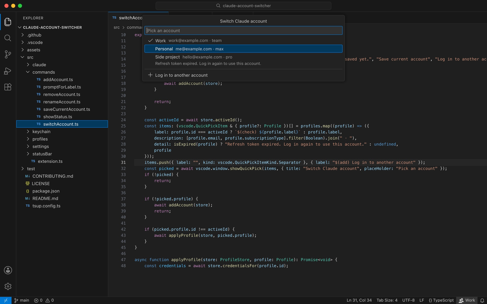

#  Claude Account Switcher

**Switch Claude Code accounts without leaving VS Code.** Your history, projects, and settings stay put. Only the login changes.

[](https://marketplace.visualstudio.com/items?itemName=michaelcummingsofficial.claude-code-login-switcher)
[](https://open-vsx.org/extension/michaelcummingsofficial/claude-code-login-switcher)
[](https://open-vsx.org/extension/michaelcummingsofficial/claude-code-login-switcher)
[](https://github.com/michaelcummingsofficial/claude-code-login-switcher/blob/main/LICENSE)
[](https://github.com/michaelcummingsofficial/claude-code-login-switcher)



Keep a work account and a personal one, or a Pro plan and a Team plan, and move between them from the status bar. Saved logins stay in your system's secure storage.

## Why I built this

On macOS, Claude Code keeps its login in the Keychain. All of the account switchers I found on the VS Code Marketplace only worked on Linux and Windows, where Claude Code keeps its login in a file.

I wanted a switcher that reads the Keychain directly and **keeps every token securely inside it**.

It works on Linux and Windows too. There, saved logins go in VS Code's encrypted secret storage, not in another plain file.

## Features

- **One click to switch.** The status bar shows who is signed in. Click it and pick another account.
- **One shared history.** There is a single `~/.claude`, so conversations, projects, settings, skills, plugins, and MCP servers are the same on every account.
- **Saved logins stay encrypted.** On macOS, each account gets its own Keychain item. On Linux and Windows, accounts go in VS Code's secret storage.
- **Works where Claude Code does.** macOS, Linux, and Windows, including Remote SSH, WSL, and container windows.
- **Keeps up with token refreshes.** Claude Code refreshes its tokens as it runs. The extension saves the fresh copy, so you can switch back later without logging in again.
- **Consistent across windows.** Every VS Code window reads the same saved state, so a switch in one window holds in the others.

## Requirements

- macOS, Linux, or Windows
- [Claude Code](https://docs.anthropic.com/en/docs/claude-code) with the `claude` CLI, signed in at least once
- VS Code 1.85 or later, or an editor that installs extensions from Open VSX

## Install

Search for **Claude Account Switcher** in the Extensions view, or run:

```sh
code --install-extension michaelcummingsofficial.claude-code-login-switcher
```

Cursor, Windsurf, and VSCodium install the same extension from [Open VSX](https://open-vsx.org/extension/michaelcummingsofficial/claude-code-login-switcher).

## Quick start

1. Sign in to Claude Code the way you normally do.
2. Run `Claude Accounts: Save Current Account` and give the account a name.
3. Run `Claude Accounts: Add Account (Log In)` to sign in to your next account. The current one is saved first.
4. Click the account name in the status bar to switch.
5. Restart any `claude` session that was already running.

## Commands

| Command                                 | What it does                                                              |
| --------------------------------------- | ------------------------------------------------------------------------- |
| `Claude Accounts: Switch Account`       | Pick a saved account and make it the live login.                          |
| `Claude Accounts: Save Current Account` | Save whoever is signed in right now.                                      |
| `Claude Accounts: Add Account (Log In)` | Save the current account, run `claude auth login`, then save the new one. |
| `Claude Accounts: Rename Saved Account` | Change an account's name.                                                 |
| `Claude Accounts: Remove Saved Account` | Forget an account and delete its saved tokens.                            |
| `Claude Accounts: Show Status`          | Show where the live login is, saved accounts, and `claude auth status`.   |

## Settings

| Setting                              | Default | What it does                                                                                                                      |
| ------------------------------------ | ------- | --------------------------------------------------------------------------------------------------------------------------------- |
| `claudeAccounts.claudeConfigDir`     | empty   | Claude Code's config folder. Leave it empty to use `CLAUDE_CONFIG_DIR`, or `~/.claude` when that is not set.                      |
| `claudeAccounts.keychainService`     | empty   | macOS only. The Keychain item Claude Code reads. Leave it empty to derive the name from the config folder.                        |
| `claudeAccounts.claudePath`          | empty   | Full path to the `claude` CLI. Leave it empty to search `PATH`, Homebrew, npm's global folder, and the native installer location. |
| `claudeAccounts.syncIntervalMinutes` | `5`     | How often to save refreshed tokens for the active account. `0` turns the timer off.                                               |
| `claudeAccounts.showStatusBar`       | `true`  | Show the active account in the status bar.                                                                                        |

## How it works

- **The live login on macOS.** Claude Code reads the Keychain item `Claude Code-credentials` for your macOS user. When `CLAUDE_CONFIG_DIR` is set, it adds a suffix: the first 8 hex characters of the SHA-256 of that path. When the Keychain rejects a write, such as over SSH, Claude Code uses `.credentials.json` in its config folder instead, and so does the extension.
- **The live login on Linux and Windows.** Claude Code reads `.credentials.json` in `~/.claude`, or in `CLAUDE_CONFIG_DIR` when that is set.
- **Saved accounts on macOS.** Each account's tokens get their own Keychain item, named `Claude Account Switcher-<id>`, and `~/.claude-accounts/profiles.json` lists the accounts. Every editor on the Mac shares them.
- **Saved accounts on Linux and Windows.** Tokens go in VS Code's secret storage, and `profiles.json` sits in the extension's storage folder. Each editor keeps its own accounts.
- **Account details.** `profiles.json` holds names, emails, plans, and expiry dates. It never holds a token.
- **Switching.** The saved login is copied over the live one, and that account becomes active.
- **Refreshed tokens.** Before every switch, every few minutes, and when VS Code closes, the live login is copied back into the active account.

An account left unused past its refresh token's expiry needs a fresh login. The switcher marks those accounts in the picker.

## Privacy and security

- Saved tokens are always encrypted. macOS keeps them in the Keychain. On Linux and Windows, VS Code's secret storage encrypts them with the system's key store: DPAPI on Windows, and a keyring such as GNOME Keyring or KWallet on Linux.
- On Linux without a keyring, VS Code falls back to weaker storage and tells you so. Install a keyring to keep saved tokens properly encrypted.
- The live login on Linux and Windows is Claude Code's own `.credentials.json`. The extension replaces it in a single step and keeps it readable by your user only, the same way Claude Code does.
- On macOS, tokens reach the `security` tool through stdin, which keeps them out of the process list. Credentials longer than 4,032 characters use the hex argument form instead, the same way Claude Code does.
- `profiles.json` and its folder are readable by your user only.
- Error messages and logs never include token material.
- The extension itself makes no network requests and collects no telemetry. It runs the `claude` CLI, and on macOS the `security` tool, on your machine.

To report a vulnerability, see [SECURITY.md](./.github/SECURITY.md).

## FAQ

### Do my conversations and settings carry over when I switch?

Yes. Every account shares the same `~/.claude`. Only the login changes.

### Do I need to restart Claude Code after switching?

Restart sessions that were already running. A running session may keep the account it started with. New sessions use the new account.

### Can I sign in with `claude auth login` in a terminal?

Use `Claude Accounts: Add Account (Log In)` instead. The extension can't tell accounts apart by their tokens alone, so it syncs a login it didn't start into whichever account was active. If that happens, remove that saved account and add both accounts again.

### Does it work with `CLAUDE_CONFIG_DIR`?

Yes, as long as VS Code can see the variable. If VS Code was started without it, set `claudeAccounts.claudeConfigDir` to the same folder. `Claude Accounts: Show Status` shows which Keychain item or file is in use.

### Does it work in Cursor, Windsurf, or VSCodium?

It is published to Open VSX, where those editors install extensions from. On macOS, every editor shares the same saved accounts. On Linux and Windows, each editor keeps its own, since VS Code's secret storage belongs to one editor.

### Does it work on Linux, Windows, or in a remote window?

Yes. On Linux and Windows it swaps Claude Code's `.credentials.json`. In a Remote SSH, WSL, or container window, the extension runs on the remote machine, where Claude Code runs too, and switches the login there.

### What happens when I remove an account?

Its saved tokens are deleted. The live login is left alone, so you stay signed in.

## Contributing

Contributions are welcome. See [CONTRIBUTING.md](./CONTRIBUTING.md).

## License

MIT © [Michael Cummings](https://www.michaelcummin.gs)

Claude Account Switcher is not affiliated with or endorsed by Anthropic. Claude and Claude Code are trademarks of Anthropic, PBC.
